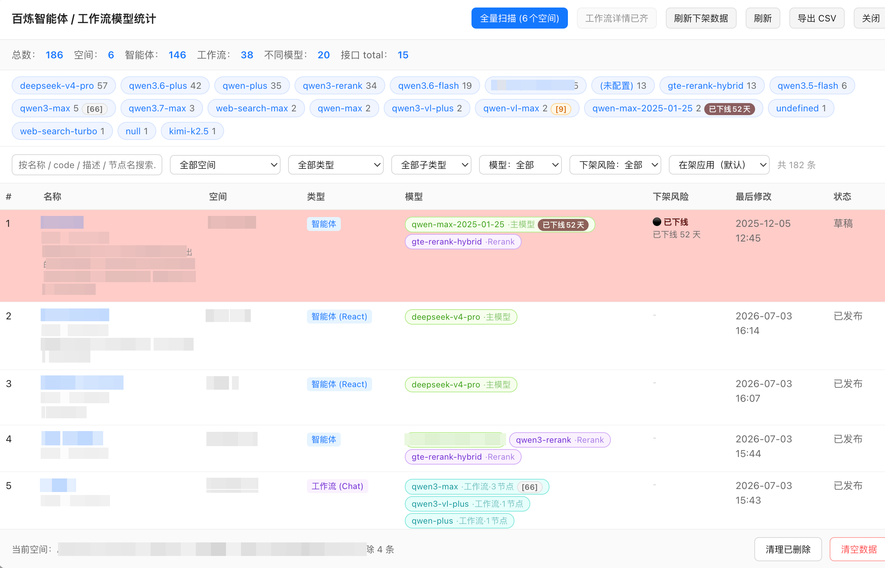

# 百炼平台 - 智能体/工作流模型统计

一个 Tampermonkey 用户脚本，用于在阿里云百炼控制台里被动拦截并聚合展示：**每个空间下的智能体和工作流分别用了什么模型**、**哪些模型即将下架**、**哪些应用已经被删除**。

面向自用，重实用，UI 直白。

## 功能一览

- 被动拦截百炼列表接口，累积每个空间的智能体、工作流基本信息
- 自动补齐工作流内部 LLM 节点使用的模型（拦截或主动派生 `getConfig`）
- 拉取阿里帮助中心「模型下线机制说明」页面，标记每个模型剩余多少天下架
- 全量扫描：主动遍历所有已知空间的所有列表页，识别本地已存但线上已消失的应用（打 `deleted` 标记）
- 弹窗查看：按空间/类型/模型/下架风险/删除状态多维筛选，导出 CSV
- 表格里点应用名字直接新开标签跳详情

## 安装

1. 装 [Tampermonkey](https://www.tampermonkey.net/)
2. 新建脚本，把 `bailian-model-stats.user.js` 全文粘贴进去，保存
3. 打开 `https://bailian.console.aliyun.com` 或 `https://bailian-cs.console.aliyun.com`，右下角会出现悬浮按钮

## 使用流程

### 第一次使用

1. 右下角悬浮按钮点「查看」
2. 到百炼「我的应用」页面浏览一遍列表，触发列表接口拦截；同时切一次空间下拉，让脚本拿到空间列表
3. 回到弹窗，此时应该已经有基础数据
4. 点顶部「全量扫描」，脚本会依次扫描所有空间的所有页，同时补齐工作流详情、识别已删除应用
5. 点「刷新下架数据」拉一次官方下架清单（24 小时缓存）

之后每次进入弹窗，被动拦截会继续累积，需要 diff 已删除时再触发一次「全量扫描」。

### 悬浮按钮

- 绿色小圆点：亮 = 最近拦截到列表接口
- 橙色小圆点：亮 = 网关模板就绪（可以派生请求）；蓝色脉冲 = 详情抓取中
- `(本次新增 / 已存总数)`：本次会话新增条数 / 本地累积总数
- 支持拖拽

### 弹窗筛选维度

- 关键词：名称 / code / 描述 / 工作流节点名
- 空间：跨空间总览或单空间查看
- 类型：全部 / 智能体 / 工作流
- 子类型：动态填充
- 模型状态：全部 / 有模型 / 无模型 / 工作流待补齐
- 下架风险：全部 / 已下线 / ≤7 日 / ≤15 日 / ≤30 日
- 删除状态：在架（默认）/ 含已删除 / 仅看已删除

顶部模型 chip 支持点击筛选。命中下架清单的会挂徽章 `[天数]` 或 `已下线X天`，颜色随紧急度变。

### 全量扫描

一键做三件事：

1. 遍历所有空间的所有列表页
2. diff 本地存量：本次没见到的记录 → 打 `deleted:true` + `deletedAt`；重新出现的 → 自动清标记
3. 每个空间扫完立即补齐该空间的工作流详情（详情接口空间隔离，必须逐空间走）

请求间隔 200ms，避免风控。

### CSV 导出

按当前弹窗里能看到的所有字段导出，共 20 列，含：

- 基本信息：名称 / code / 空间 / tenantId / 类型 / 子类型
- 模型信息：主模型 / 联网搜索模型 / Rerank 模型 / 工作流模型 / 工作流节点数
- 下架风险：等级 / 最近下架模型 / 下架日期 / 剩余天数 / 替代模型
- 状态列：应用被删除时会覆盖为 `已删除（时间）`
- 描述与时间戳

## 数据源

脚本只拦截 / 派生下面这几个百炼网关接口（`https://bailian-cs.console.aliyun.com/data/api.json`）：

| API | 用途 |
|---|---|
| `zeldaEasy.broadscope-bailian.app-control.list` | 应用列表 |
| `zeldaEasy.broadscope-bailian.app-orchestra-flow.getConfig` | 工作流详情（节点 + 模型） |
| `zeldaEasy.bailian-dash-workspace.space.listWorkspaces4Agent` | 空间列表（tenantId → 名称映射） |

以及一个只读文档接口，用于下架清单：

- `https://help.aliyun.com/help/json/document_detail.json?nodeId=2879055`

## 项目约束

代码风格遵循 `AGENTS.md` 里的四条硬规则，简单说：

1. **Fail Fast**：接口路径直接访问（`payload.data.DataV2.data.data`），结构变了立刻抛错，不用 `?.` 或 `try/catch` 兜底
2. **URL 用精确参数匹配**：`api=xxx` 层的字符串匹配，不做响应结构探测
3. **XHR 拦截区分 responseType**：`json` 读 `this.response`，其他读 `this.responseText`
4. **UI 纯 DOM 构建**：全部走 `ce()` 工厂，不允许 `innerHTML` 拼字符串

## 存储

用 `GM_setValue` 持久化，键名：

- `bailian_model_stats_apps`：应用主数据
- `bailian_model_stats_workspaces`：空间映射
- `bailian_model_stats_deprecation`：下架清单缓存

清空数据按钮会一次清掉全部。

## 已知限制

- `sec_token` 每会话不同，所以脚本不做跨会话的主动请求，全靠当前会话拦截的模板派生
- 详情接口是**空间隔离**的，用当前空间的 token 拉别的空间会 401，扫描逻辑严格按 tenantId 分批
- 只覆盖 `type=5`（智能体）和 `type=7`（工作流）两类，其他类型直接显示 raw type
- 下架清单页面结构如果阿里改了 HTML 表格结构，需要更新解析逻辑（当前实现假设是 4 列：类别 / 模型 / 下线时间 / 替代模型，且首列有 rowspan）

## 版本

参考脚本头部 `@version`。
